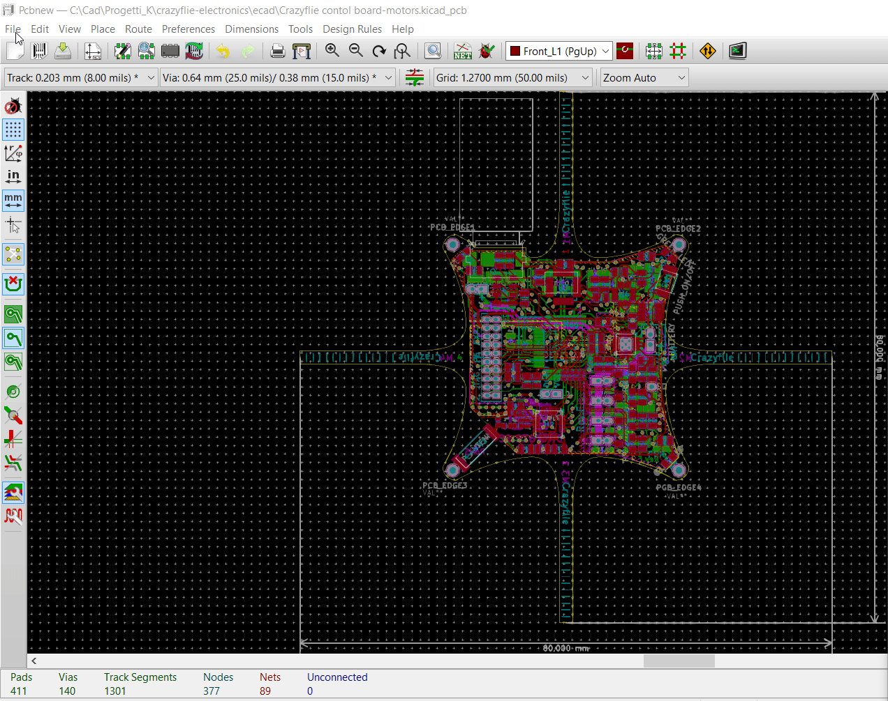

# kicad-action-plugins
kicad action plugin tools

## action_menu_annular_check.py
A script to check for annular ring violations  
for PTH, NPTH pads and vias  

requirements: KiCAD pcbnew > 4.0 built with KICAD_SCRIPTING_ACTION_MENU option activated  
release "1.5.3"  

'action_menu_annular_check.py' checking PCB for Annular Ring in PTH, NPTH and Vias  
(SMD, Connector and NPTH are skipped)  
default Annular Ring >= 0.15 both for TH Pads and Vias  
to change values modify:  

    AR_SET = 0.150   #minimum annular accepted for pads  
    AR_SET_V = 0.150  #minimum annular accepted for vias  
    DRL_EXTRA = 0.100 #extra drill margin size for production  

Launch the Annular Check script in pcbnew from Tools menu:  

## todo
- add colors to output  

