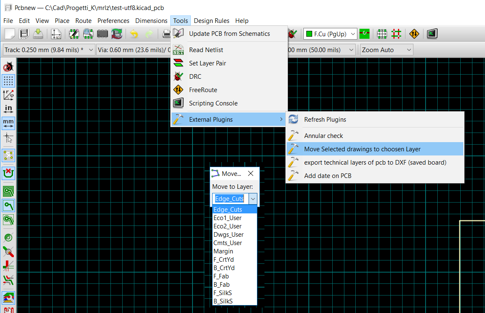

# kicad-action-tools
#### <b>A suite of kicad action plugin tools</b>

- ### Annular Ring Checker
Check your kicad_pcb for annular ring violations:  
PTH Plated Trough Hole, NPTH Non Plated Trough Hole Pads and Vias  

- ### action_menu_pcb2dxf
A script to export technical layers of kicad PCB to DXF  
DXF generated file has single line draw as it should be for mechanical interchange (this option is missing in pcbnew plot)  
  
- ### action_menu_move_to_layer
A script to Move Selected Drawing(s) to chosen new Layer (available only in GAL) 

- ### action_positions
A script to Generate Position Files for SMD, THD, Virtual, ALL 
  
---
## action_menu_annular_check.py
A script to check for annular ring violations  
for PTH, NPTH pads and vias  

requirements: KiCAD pcbnew > 4.0 built with KICAD_SCRIPTING_ACTION_MENU option activated  
release "1.5.3"  

'action_menu_annular_check.py' checking PCB for Annular Ring in PTH, NPTH and Vias  
(SMD, Connector and NPTH are skipped)  
default Annular Ring >= 0.125 both for TH Pads and Vias  
to change values modify:  

    AR_SET = 0.150   #minimum annular accepted for pads  
    AR_SET_V = 0.150  #minimum annular accepted for vias  
    DRL_EXTRA = 0.100 #extra drill margin size for production  

Launch the Annular Check script in pcbnew from Tools menu:  

### todo (annular_check)
- [ ] add colors to output list  

---
## action_menu_pcb2dxf
**kicadpcb2dxf**  
_dxf exporter for mechanical layers of a kicad_pcb board_  
- "Dwgs", "Cmts", "Edge", "Eco1", "Eco2", "F.Fab", "B.Fab", "F.CrtYd", "B.CrtYd"  
- the dxf generated has single line draw as it should be for mechanical interchange (this option is missing in pcbnew plot)  

creates DXF file of technical layers of the selected kicad pcb board
  
  

(this is a part of kicad StepUp tools; please refer to kicad StepUp tools for the full licence)

 kicadpcb2dxf: Copyright (c) 2015 Maurice easyw  
 dxf_parser="r12writer from ezdxf 0.7.6": Copyright (C) 2016, Manfred Moitzi with MIT License  
 
done:  
- [x] added line, circle, arc primitives  
- [x] added footprint support  
- [x] fixed negative arc case  
- [x] added text support (mirror & alignement not supported)  
- [x] added multiline text  
- [x] add quote support  
  
### todo (kicadpcb2dxf)
- [ ] tbd

---
## action_menu_move_to_layer
A script to Move Selected Drawing(s) to chosen new Layer (available only in GAL) 

requirements: KiCAD pcbnew > 4.0 built with KICAD_SCRIPTING_ACTION_MENU option activated  
release "1.1.0"  

    A script to Move Selected Drawing(s) to chosen new Layer (available only in GAL) 
    How to use:
    - move to GAL
    - select some draw objects
    - call the plugin
    - select the new layer
    - selected draw objects will be moved to new layer

Launch the 'Move Selected drawings to chosen Layer' script in pcbnew from Tools menu  

- ### action_positions
A script to Generate Position Files for SMD, THD, Virtual, ALL

The script will generate Fabrication POS files for:

- SMD
- THD
- VIRTUAL
- ALL
