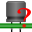

# kicad-action-tools
#### <b>A suite of kicad action plugin tools</b> 

- ### Annular Ring Checker
Check your kicad_pcb for annular ring violations:  
PTH Plated Trough Hole, NPTH Non Plated Trough Hole Pads and Vias  

- ### Snap Selected Footprint(s) to Grid
Tool to move the selected footprint module(s) to the Grid.  
The Modules can be easily aligned to GridOrigin or to Auxiliary Origin. 

- ### Fabrication Footprint Position
Tool for the creation of the necessary files for the production of the printed circuit board.  
Generate Position Files for SMD, THD, Virtual and ALL components, referred to Auxiliary Origin. 

- ### Move Selected Drawings to chosen Layer
Tool to Move Selected Drawing(s) to the chosen new Layer.  

- ### Export pcb technical layers to DXF
Tool to export technical layers of kicad PCB to DXF.    
The DXF generated file has single line draw and different layers for each pcb technical layer.

- ### Checking 3D missing models
Tool to check the 3D missing models with the following extensions '.stp', '.step', '.stpZ'

---
## Annular Ring Checker
Check your kicad_pcb for annular ring violations:  
PTH Plated Trough Hole, NPTH Non Plated Trough Hole Pads and Vias  

Launch the Annular Check script in pcbnew from Tools menu:  

---
## Move Selected Drawings to chosen Layer
Tool to Move Selected Drawing(s) to chosen new Layer

requirements: KiCAD pcbnew > 4.0 built with KICAD_SCRIPTING_ACTION_MENU option activated  
release "1.1.0"  

    A script to Move Selected Drawing(s) to chosen new Layer (available only in GAL) 
    How to use:
    - move to GAL
    - select some DRAW objects
    - call the plugin
    - select the new layer
    - selected draw objects will be moved to new layer

Launch the 'Move Selected drawings to chosen Layer' script in pcbnew from Tools menu  

---
## Checking 3D missing models

Tool to check the 3D missing models with the following extensions '.stp', '.step', '.stpZ'

